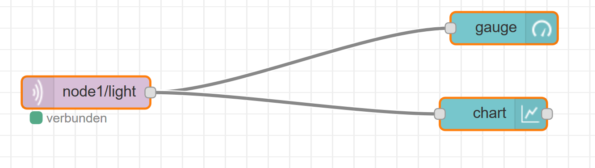

# Lecture 1
## Self Presentation
### Who are you?
- Iris Pöchtrager, 23 years old
- Studied Software Engineering in the Bachelor, now Mobile Computing
- Working at softaware in Asten

### What do I expect from H&B Automation?
I expect to learn how I can automate a few thing myself at home - f.e. lights, and other things. I expect to get a kickstart in this area to be easily able to deepen the knowledge later if I want to.

### If I were in a team with 4 persons, I would bring to the table:
#### Strengths
- Punctuality
- Perfectionism
- Accuracy

#### Weaknesses
- Sometimes not a lot of time & a little stressed
- Impatient
- Perfectionism

## Videos
### Big Bang Theorie
- Turning on light
- Turning on stereo
- Racing cars
- Public access to turning on/off things
- Sending signal over internet
- Very feasible - done today

### Siemens Video
- Very fast elevators - increase efficiency
- Increase comfort, security, safety
- Using Holograms to interact with
- Not yet feasible - maybe with AR
- Siemens video 
- Exchange blocks of a building (use as elevator) - not feasible
- Intelligent energy management system -> mix in from public system
- Consumption optimization - integrate in building management system
- Guide people through buildings with signals on their phone
- Safe evacuation with system - emergency mode, with lights and sounds
- Separate people when safe rooms are full
- Networking city districts

### Bosch Videos
- Mow the lawn like a bosch: let all lawn mowers go at same time
- Park like a bosch video: automated parking
- Wake up like a bsoch: automatic coffee brewing

### Domains:
- Security Domain
- Energy Management
- Navigation and Routing
- Home Automation
- Resource Management
- Privacy (mentioned negatively)

### Technologies:
- Machine to machine communication (lawn mowers)
- Lights
- Wireless Communication
- Virtual Reality
- Remote Control/External Access
- Cloud
- Synthesis/Integration

### Crazy/Weird:
- Lack of privacy (Cars)
- Remote Access (Cars)
- Building with block came out to be used as an elevator

### Feasibility:
- Holograms possible to do (with AR/VR)
- Lots of things in Bosch videos feasible!

## Internet of Things
### Domains
- Logistics
- Health
- Home automatism
- Machine to Machine communication

### Questions about Problems and other issues
[Work together with Alex](../../../2%20-%20Project1/HaBA%20-%20Questions%20Iris%20Alex.md) 
[Work of Manuel and Lorenz and synchronization of both works](../../../2%20-%20Project1/Home%20and%20Building%20Automation%20-%20Questions.md)

## Hello World of IoT and H&B Automation
### Demo Notes
- not start Pi without shutting it down properly
- start up: see yellow LED blinking a lot
- should display as new network when started properly
- after flashing SD (Lorenz told me)
    - open SD ("boot") 
    - can edit wifi-file: name of wifi
    - log into network shown on little screen
- go to: https://iotgateway - accept connection
- see webportal now - all documentation there
- today: first little tutorial
- go to example folder - file manager shown there
- open User Menu with F2 - can then adopt devides in showing menu

### Project notes
- wrong image at the beginning
- As we had one adapter that was very fast and one that was very slow, it was faster to use the first adapter for both teams of our group. Therefore only one of us (Lorenz) then downloaded the new image and flashed the SD Cards of both groups with the fast adapter.
- using Etcher for flashing the image onto the SD Card
- we did not decompress the image before flashing it

### Adoption Phase
- to get into adoption phase, press button twice while starting
- use the User Menu to search for node while node is still blinking
- you have to go into a node folder in the folders for the adoption to work
- **Encountered Problems:**
    1. The adoption did not manage to upload all the necessary files (Error Code: 10)!
        -> using wrong charger (not the standalone charger but rather a dock). this almost broke the Raspberry Pi because the charger does not provide enough power to the Pi because it uses a not good enough protocol
        -> connected too many dongles to the Pi which is always a bad thing to do. connect only as many dongles to the Pi as necessary! Thus, we removed all dongles except one from the Pi.

    2. We accidentally deleted the node1 and node2 folder. We tried to abort the deletion of the folders, however it was already too late. We now have two options to fix the problem:
        1. First, we could use the web interface to fix the issue. However, by deleting the folder structure we could not access the menu.
        2. Second, as we could not access the menu in the web interface, we flashed a new SD card.

    3. Even with a fresh image we could not scan for adoptable nodes. We decided to reset the node. After resetting, we put it back into adoption mode. This did not work again.

    As we could not solve the above problems, we asked Ulli for help. He suggested trying it with his kit to find the source of the problem (or at least limit it to a certain area). In the end though, it was found out that wrong versions for the dongles were used. We set the project on hold for today then.

### Thoughts/Opinions
Getting started with the Raspberry Pi was kind of messy for me. Lorenz helped me here a lot, because the speed was very partly very fast and as I am completely new to the topic, I didn't catch all the important information at the first time. Also in the end we worked together as a team (the four of us) because Alex and I were not sure what we were doing at some points and Lorenz and Manuel helped us out a lot inbetween. Furthermore, we decided to use the Raspberry Pi of the lecturer as this was supposed to work best and we had so many troubles and there was only one, so we didn't really have the option there anymore to work in teams of 2.

Generally, I think we all tried our best in this project today. I also think that Alex and I got a good feeling for how to work with Node Red and the Raspberry Pi (even though a lot of things didn't work as expected). Working together with my team worked very well though I think that the task was actually quite a good starter project if the things would have worked. 

I would appreciate it, if some of the important information would be shown a little slower and more in detail. For example when showing the adoption demo, there was always talk about pressing a "button" on D3. Maybe I missed this information but I did, at that point, not get, that pressing a button means grounding the pin - as I didn't have anything to do with microcontrollers I didn't know this before and therefore then just assumed that the reset button is meant.

## Hello World of IoT and H&B Automation - Day 2
### Update Raspberry Pi Image
can either happen by flashing the new image or by upgrading in the User Menu of the Raspberry Pi. When upgrading via the User Menu, the new version is pulled from git, the current version is uninstalled and the new version is installed.

Flashing the nodes via cable is difficult - doesn't work 70% of the time. Ulli flashes them therefore for us.

**After Updating:**
- run "iot" in command line
- run "upgrade_cache"

## Switch RGB Light with Colour Picker

### Hardware Setup
1. connect RGB-LED to the Node
    - connect RGB to Breadboard
    - connect Node to Breadboard: the VCC on 3V3, R and G and B to D pins
2. the order of the D pins that R, G and B are connected to is important for the Software Setup later

### Software Setup
- set following in setup.cpp of node: rgb_single(rgb1, D3, D2, D1, true);
- we had at first the error that we didn't set the "true" that inverts the values, so we got wrong colours at the beginning
- rgb1 is the way we named our RGB-LED
- The pins that are entered in this command have to be in the same order as they are connected to the node (from the RGB light)
- To switch the colour with a colour picker in NodeRed:
    1. drag colour picker onto canvas
        - edit send to "multiple values during editing"
        - payload: "current value as a string"
    2. mqtt ouput
        - set topic to nodename/rgb1/rgb/set
        - connect colour picker to this mqtt node
    3. drag switch onto canvas (to switch on/off of light)
        - switch on payload to string and set it to "on"
        - switch off payload to string and set it to "off"
    4. new mqtt ouput
        - set topic to nodename/rgb1/set
        - sets not rgb colour but on/off
        - connect switch to this mqtt node
- to access the UI via the phone:
    1. the phone has to be connected to the WiFi of the Raspberry
    2. enter https://iotgateway
    3. select Red Node UI

## Analog Light Sensor
### Hardware Setup
1. connect Light Sensor (the one with the weird pin sticking out) = Photosensor
    - connect value pin to analogue pin of node
    - connect volt pin to 3V3
    - connect ground to ground

### Software Setup
1. set following in setup.cpp of node: analog(light).with_precision(10);
    - light is the name of the input source - has to be used in NodeRed later
    - with_precision(10) means that only changes that are bigger than 10 units will be forwarded
    - with_precision can also get left out, then every change is propagated
- setup NodeRed:
    1. drag an mqtt input node onto an empty canvas
        - set topic to nodename/light
    2. drag a gauge onto the canvas
        - connect node to gauge
    3. drag a chart onto the canvas
        - connect node to canvas

