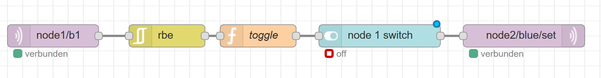
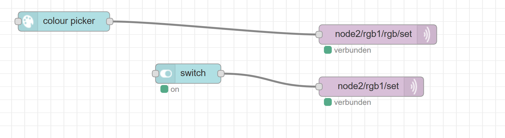
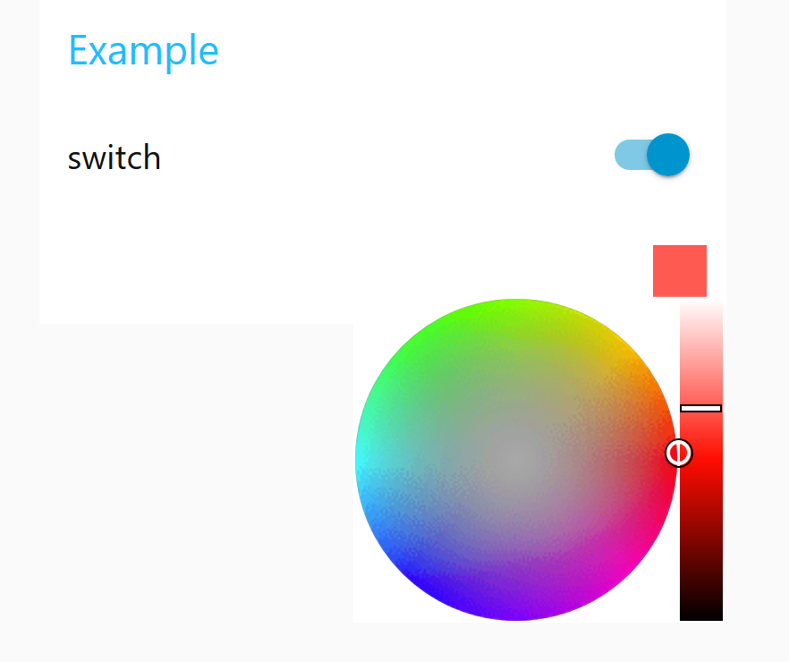
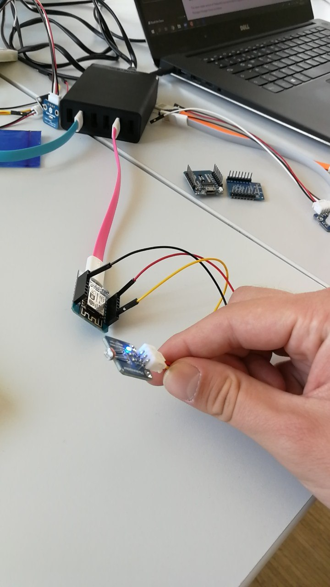
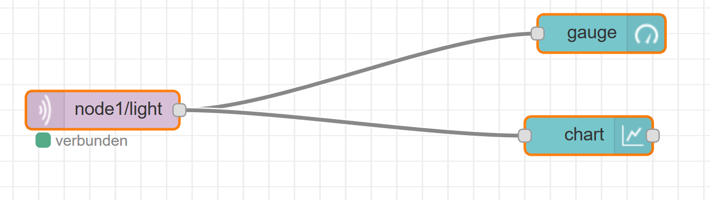
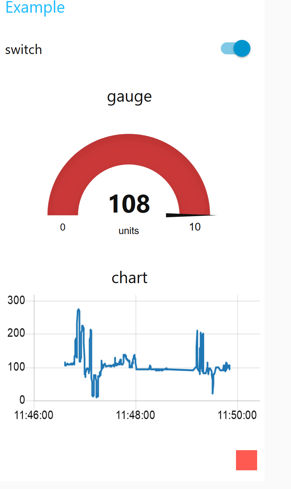
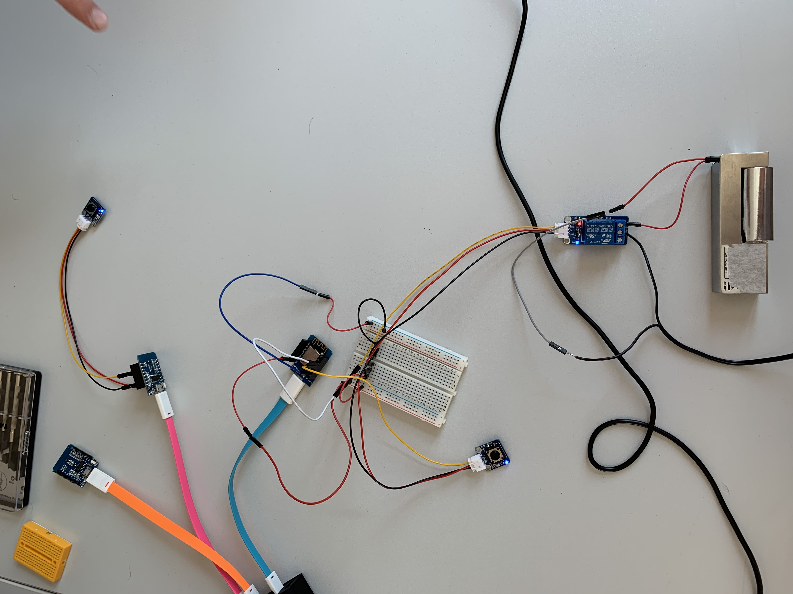
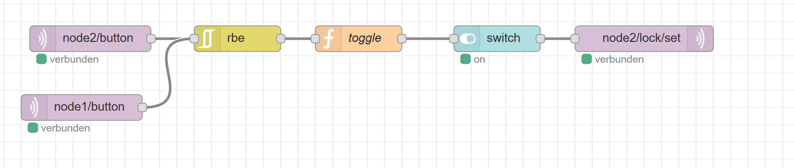

# Lecture 2
## Lighting an LED Day 2
### Update Raspberry Pi Image
can either happen by flashing the new image or by upgrading in the User Menu of the Raspberry Pi. When upgrading via the User Menu, the new version is pulled from git, the current version is uninstalled and the new version is installed.

Flashing the nodes via cable is difficult - doesn't work 70% of the time. Ulli flashes them therefore for us. After the nodes were flashed we were able to adopt them to our Raspberry Pi.

**After Updating:**
- run "iot" in command line
- run "upgrade_cache"

### Hardware Setup
1. connect a button to node1
    - ground cable (black) connected to G (ground)
    - signal (S) connected to D3
    - Volt (V) connected to 5V

### Final Software Setup
1. set following in setup.cpp of node1 and node2: 
    ```
    output(blue, ONBOARDLED, "off", "on").set("off");
	input(b1, D3, "depressed", "pressed");
    ```
2. In the NodeRed interface make the following changes:
    - set the output mqtt node to: node2/blue/set



## Switch RGB Light with Colour Picker

### Hardware Setup
1. connect RGB-LED to the Node
    - connect RGB to Breadboard
    - connect Node to Breadboard: the VCC on 3V3, R and G and B to D pins
2. the order of the D pins that R, G and B are connected to is important for the Software Setup later

### Software Setup
- set following in setup.cpp of node:
    ```
    rgb_single(rgb1, D3, D2, D1, true);
    ```
- we had at first the error that we didn't set the "true" that inverts the values, so we got wrong colours at the beginning
- rgb1 is the way we named our RGB-LED
- The pins that are entered in this command have to be in the same order as they are connected to the node (from the RGB light)
- To switch the colour with a colour picker in NodeRed:
    1. drag colour picker onto canvas
        - edit send to "multiple values during editing"
        - payload: "current value as a string"
    2. mqtt ouput
        - set topic to nodename/rgb1/rgb/set
        - connect colour picker to this mqtt node
    3. drag switch onto canvas (to switch on/off of light)
        - switch on payload to string and set it to "on"
        - switch off payload to string and set it to "off"
    4. new mqtt ouput
        - set topic to nodename/rgb1/set
        - sets not rgb colour but on/off
        - connect switch to this mqtt node
- to access the UI via the phone:
    1. the phone has to be connected to the WiFi of the Raspberry
    2. enter https://iotgateway
    3. select Red Node UI




## Analog Light Sensor
### Hardware Setup
1. connect Light Sensor (the one with the weird pin sticking out) = Photosensor
    - connect value pin to analogue pin of node
    - connect volt pin to 3V3
    - connect ground to ground



### Software Setup
1. set following in setup.cpp of node: 
    ```
    analog(light).with_precision(10);
    ```
    - light is the name of the input source - has to be used in NodeRed later
    - with_precision(10) means that only changes that are bigger than 10 units will be forwarded
    - with_precision can also get left out, then every change is propagated
- setup NodeRed:
    1. drag an mqtt input node onto an empty canvas
        - set topic to nodename/light
    2. drag a gauge onto the canvas
        - connect node to gauge
    3. drag a chart onto the canvas
        - connect node to canvas




## Smart Lock
Setup of a lock that can be locked/unlocked via buttons on two different Wemos or via Phone.

### Hardware Setup
1. connect a relay to the lock (setup can be seen in picture below)
2. two Wemos are used
3. connect one button to each of the Wemos (we used a breadboard for one of the Wemos)
4. connect the relay to the breadboard used with one of the Wemos



### Software Setup
1. set following setup.cpp of Node1 (only having one button attached):
    ```
    input(button, D1, "depressed", "pressed");
    ```
2. set following setup.cpp of Node2 (having the breadboard with button + lock connected)
    ```
    input(button, D2, "depressed", "pressed"); 
    relais(lock, D1, "on", "off");
    ```
3. In Node Red, we used basically the same setup as when lighting the single LED (first task)
    - Mqtt input connected to rpe, connected to a function (same as in first task), connected to a switch, connected to the mqtt lock
    - the mqtt lock is a mqtt output where "node2/lock/set" is set as a topic
    - Instead of only one Mqtt input as in the first task, we now need two inputs (because we have two buttons)
        - one is set to "node1/button"
        - one is set to "node2/button"
        - both are connected ro the rpe



## Thoughts/Opinion
It was actually quite nice to finally see some things working. Seeing some results also made the lecture a lot more fun. I still had the feeling of being stressed all the time, but the results were nice anyways.

When it got to the smart lock the hardware setup was kind of difficult to understand again for me, but my team mates were really helpful as they tried their best explaining it to me and getting me on their level of knowledge. After this lecture I really got the feeling that I understood a lot more, also about what we were trying to the day before. I was also able to get familiar with RedNode.