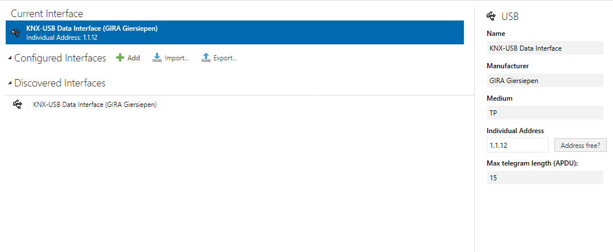
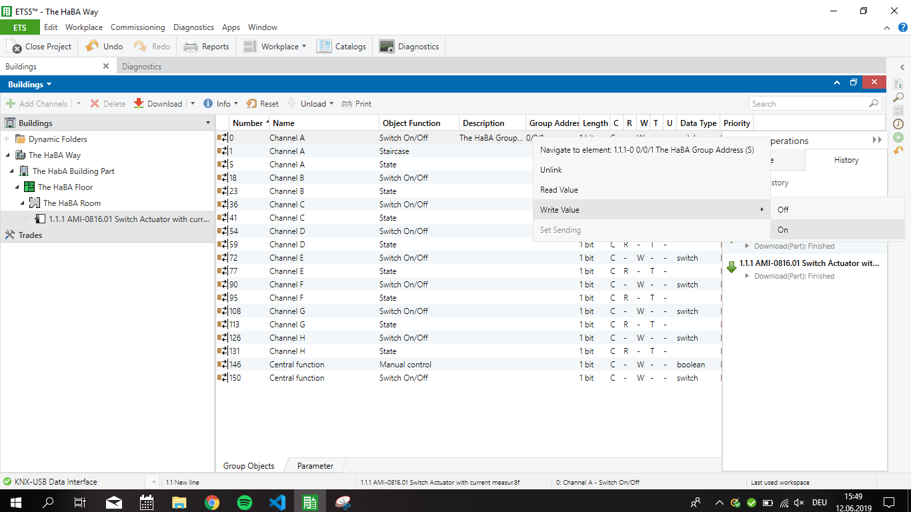

# Lecure 4
## Protocols presentations
### Research to questions asked during presentation
**Serial vs. TCP/IP**
Two main types of Modbus:
- Modbus RTU = serial protocol
- Modbux TCP = working with TCP/IP

**Discovery**
[Not really a way to detect nodes](https://control.com/thread/1306158603#1306158603)
- very small resources needed to create nodes
- work has to be done manually (typing in codes, ...)

### SPI (Serial Peripherial Interface)
- full-duplex synchronous data bus
- clock, data and select lines
- data transmission between microcontrollers and small peripherals
- receiving hardware: can be shift register (cheaper & simpler)
- very high binary rate
- 3 types of signal:
    1. MOSI
    2. MISO
    3. SS
- virtual ring topology
- communication on different protocols:
    - USB
    - Ethernet
    - ...
- Example of SPI in class
    - card reader
- also used a lot in phones
- often run on 3.3 Volts - often destroyed with higher voltage
- rather short length (under a meter - probably cm)

### I²C (Inter-Integrated Circuit Bus)
- only two wires:
    1. SDA: data transmission
    2. SCL: clock
- runs on 5 Volts typically - but also allows 2V
    - 0: less than 30% voltage
    - 1: more than 70% voltage
- limited to about 10 meters
- bus speed determined by slowest node on bus
- allows multi master
- can have 127 slaves to one master because of address space
- typically much slower than SPI
- slave can keep clock low if he needs more time to process
- low-active
    - cool when working with Arduino: can use same bus!
    - works by using 3 Volts instead of 5 Volts
    - usually have to work with capacitors
- one of the easiest bus systems to set up
- used between microcontrollers
- simple and low cost
- Systemmanager Windows: typically see I²C busses
- discovery (what devices are on I²C bus) possible?
    - yes (a little), because they have addresses
    - some addresses are reserved for specific devices (not 100% sure, but kind of an agreement)

### OneWire
- one data line + ground reference for communication
- parasitically powered
- slaves have unique ID from manufacturer
- up to 300 meters
- up to 75 devices on one bus
- Voltage from 2.8 to 5.25
- rather slow
- applications: f.e. identification and authentication, ...
- very simple!

### RS-232
- = Serial Port
- was used widely to connect f.e. modems to other devices
- mostly 9-pin connector was used
- straight or twisted pair cable
- 15-30 m distance (theoretical limit: 300 m)

What does non-differential mean? (Means same as asynchronoulsy?)
- then explained when explaining RS-422

Used in what kind of automation? Example?
- mentioned by Ulno later: quite ubiquitous in the area

### RS-422
- symmetrical = uses clock
- uses differential signals
- twisted pair cable
- full duplex protocol
- used in
    - early Macintosh computers (could switch between RS-232 and RS-422)
    - range extender for RS-232 (because RS-422 longer distance)

### RS-485
- three state logic
    - individual transmitters can be deactivated
    - lineas bus topology
    - two wires
- Master-Slave
- uses much smaller voltages than RS-422
- three signals
    - sending
    - receiving
    - on/off
- applications
    - programmable logic controllers
    - factory floows
    - physicl layer in many automation protocols (Modbus, Profibus)
    - lighting controllers in theaters
    - building automation
        - video surveillance systems
        - access control card readers

### Zigbee
- mesh topology (star, tree or net)
- same frequency rates as Bluetooth/WiFi
- wireless communication protocol with focus on machine to machine communication
- operating in smae or overlapping areas of networks (internet) but not interfering
    - can interfer according to Ulno
- end-devices only communicate with their parent nodes
- evolving over last years
- scalable, not breaking if removing/adding nodes dynamically
- knowledge about zigbee compliant devices needed
- no single point of failure
- self-healing
- domain:
    - home
    - building
    - industrial
    - retail
    - health
- usage:
    - smart metering
    - smart grid monitoring
- devices using/supporting:
    - Amazon Echo Plus
    - Philips Hue
    - Osram Lightify
    - Nuki Smart Locks
    - ...

Does only Amazon Echo Plus support Zigbee or Amazon Echo and Echo Dot too (specifically only Amazon Echo Plus mentioned)?

### Z-Wave
- less expensive than Zigbee
- focus on home automation
- independent of central hub (mesh network)
- Z-Wave Plus: improved range, energy consumption, bandwidth, OTA Updates
- simple setup - Plug&Play
- low latency
- 100 kBit/s
- range: up to 150 m
- domain: home automation

### X10
- easy communciaton protocol
- devices very cheap
- connect appliance module to device and the power line
- low throughput
- latency: 1/2 to 3/4 second to receive responder
- interferences in power circuit can cause problems for further distances
- problems in eurporean market due to different voltage (mostly used in US)

### DMX
- used for light control, fog machines, dimmers, christmas light
- digital communication, RS-485 for physical layer
- shielded twisted pair
- asynchronous serial data

### KNX
- separate power supply and device control into two separate networks
- devices made by different manufacturers
- devices just plugged in (= actors)
- sends plain text data

### Ebus
- control heating & solar components
- European standard, mostly developed and used by German companies
- can provide power to participants
- 2 wires, twisted pair
- fixed data rate: 2400 baud -> very slow!
- start and stop bits
- old documentation, not easy to find

### CAN Bus
- mainly used in car industry
- also used in automotive industry
- pupose for invention: reduce wiring cost
- CAN Bus Low: very cheap, not so secure, slower
- CAN Bus High: more expensive, securer, faster
- supports different bus structures, but normally normal bus used
- dominant and recessive state, have also priority
    - if two nodes send at same time - highest priority wins
    - higher priority overrides state
    - avoid collisions

## KNX
did the KNX certificate, can be found in the Lecture 4 folder

### KNX Exercise
We actually did the exercise itself in Lecture 5, but did all the preparation work in Lecture 4, which is why I put it here.
1. Turn on KNX
2. Connect to KNX via the USB Cable
3. Use ETS to work with KNX
    1. add current KNX device as device
    
    2. create a new project
    3. Add Building, Floor and Room to project
    4. Open Catalog, search for "AMI-0816.01" and add it to the room
    5. Select the switch
    6. Select f. e. Channel A, do a right click
    7. Select "Write Value" -> "On"
    8. LED turns on
    

## Thoughts/Opinions
I did not like the presentations of the protocols. For me, it doesn't really make sense to listen to the explanation of so many protocols in such a short time and have to take notes and have to think about questions. That way, it's quite sure, that I don't remember anything of the protocols after the presentations. But maybe others had a more positive experience of the presentations. Another point for me was, that the presentations took a lot of time that we maybe would have been able to put to a better use.

The KNX exercise was also really confusing for us. Lorenz was the one who went with Ulno to the KNX and he was sick the day we did the exercise. So we first didn't know what do at all. After Ulno showed us at least what we should try to control on the KNX, we were actually able to do it pretty fast. I think, if there would have been more time, I also would have liked to play around with KNX more, but we had to get all the other stuff done too. In the KNX exercise we all worked together - Alex had downloaded ETS and we all figured out together how to light the LED over ETS then.

