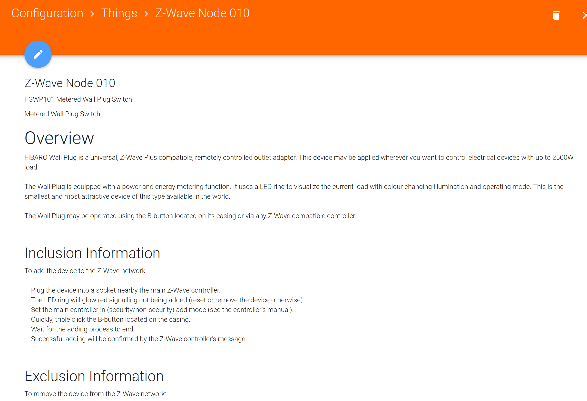

# Lecture 5
## Project 2 Presentation
### Group 1
We presented as Group 1

### Group 2
- goal: home automation < 20.000 €
- automatic garage
- NFC Chip in right hand to open door
- pool opens automatically
- mutliple cleaning robots & lawn mowers
- pool regulates heat&cooling itself
- home entertainment system
- smart security cameras
- lots of DIY (Wemos, Raspberries, ...)
- presentation was very nice - well thought-through

Are the costs for implementing the NFC Chip into the hand also calculated?

### Group 3
- family with several people
- very nice user story!
- smart pool
- Alexa
- smart washing machine
- set time for gaming by home automation - enforced by parents
- Toilet paper recorder (flic smart buttons)

Why not using Philips Hue but another system? -> Asked by Manuel

### Group 4
- Scenario guy very environment friendly
- using Loxone a lot
- invested a lot of thoughts in power redundancy and how much energy would be used by all the devices
- detect whether windows are open or closed
- close shutters automatically when room gets too hot
- context aware lighting
- team went a little bit crazy with all the Loxone things
- nice visualization of where f.e. speakers in the buidings are at the end of the presentation

Why did you choose to get all your devices from Loxone? Seems extremely expensive?

### OpenHab experiments
#### Philips Hue
1. Install OpenHab (start with start.bat, then open localhost:8080)
2. Open Paper UI
3. Add Hue Binding in Bindings
4. Got to Inbox -> +
    - Select Hue
    - OpenHab searches for Hue
    - Hue is found -> add as item
    - in inbox: add every Hue found as item
5. Go to Control
    - Both Hues can be turned off/on and the light changed here
    

#### Temperature, humidity and light sensor
We also tried a temperature and a humidity sensor.
1. Connect the temperature, the humidity and the light sensor to a Wemos connected to a Raspberry
2. In setup.cpp we set the following:
    ```
    dht(humidity, D1); 
    dht(temperature, D2); 
    analog(photo).with_precision(10);
    ```
3. In OpenHab we had to set up a MQTT Broker
    1. Install the MQTT Binding in the Add-Ons
    2. Got to Inbox, select MQTT Binding
    3. Select MQTT Broker
    4. Set IP-Adress, username and password
    
4. Set up the MQTT Things
    1. Got to Inbox, select Generic MQTT Thing
    2. The broker is already selected
    3. Add a channel
        1. Set the channel
        2. Set an ID
        3. You can set a label to give the channel a name (f.e. "Temperature")
        4. Set the MQTT state topic (f.e. "node2/temperature/temperature")
            - the state topic could be empty if the channel should be write-only
            - the command topic can be empty if the channel is read-only
    
5. The MQTT Things are then visible in the control panel again

#### Show text on display
To show a text on the display, we did pretty much the same as when adding the temperature, ... sensors
- in setup.cpp set the following:
    ```
    U8G2_SSD1306_64X48_ER_F_HW_I2C u8g2(U8G2_R0);
    display(raspi_display, u8g2, u8g2_font_profont29_mf);
    ```
- again add a channel to the Generic MQTT Thing
- in the configuration of the display channel we had to set now the command topic and not the state topic, so that we can set a value
- in the control panel the value then can be sent


#### ZWave Device
1. Add ZWave Binding in Openhab
2. Go to input
    - use ZWave Binding to add controller
    - set port to the port the USB ZWave controller is connected to
    - the ZWave controller can also be seen in the control
    
3. Add another ZWave item via ZWave Binding
    - Now Nodes are found
    - Add the Nodes that are shown
4. At the first tries, we had the following problem:

    - Somehow the Zwave node wasn't added correctly and it tooks us quite a long time to figure out how to solve this problem
    - To solve the problem we did the following steps:
        - the plug has to be in discovery mode (green light pulsing)
            - press button on plug so often, that green light pulses
        - In the controller settings:
            - set security to no security
            - activate the action "soft reset controller"
        - Following these things fixed our problem, the node then showed the following description:
        
5. The Plug was then visible in the control panel
    

#### Kodi
1. Manuel did installed Kodi on this Laptop
2. Adding the Kodi Binding on OpenHab
3. Search for Manuel's computer with the Kodi Binding
4. Control Kodi on Manuel's laptop over Openhab - play music, next track, ...


### Home Assistant experiments
Were mainly done by Manuel and Alex, documentation to be found [here](../../Lecture%20Manuel/Lecture%205/ReadMe.md)

## Opinion/Thoughts
This day we split the work very well - while I was working with OpenHab all the time, Manuel and Alex worked with HomeAssistant and Michael setup all the hardware things (Lorenz was sick). I also helped out Martin Schneglberger from the other group, as they had a lot of problems with getting OpenHab, the Philips Hue and the Z-Wave Plug to work.

The Z-Wave Plug did not work at all in the beginning, which was quite annoying as it took forever. It would have been easier if there would have been a manual or something like that provided. Generally the work was quite stressful again, as - as mentioned - the Z-Wave plug didn't work for a very long time and it was a lot to do. Working with the Hue was very easy, as was adding the sensors to OpenHab. All in all the lecture was quite effective and showed how much work we are actually able to do in a quite short time.
