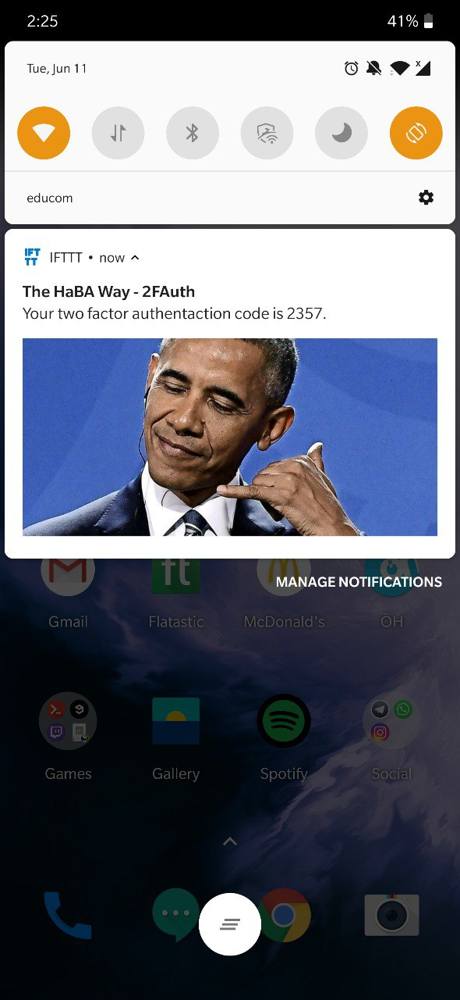
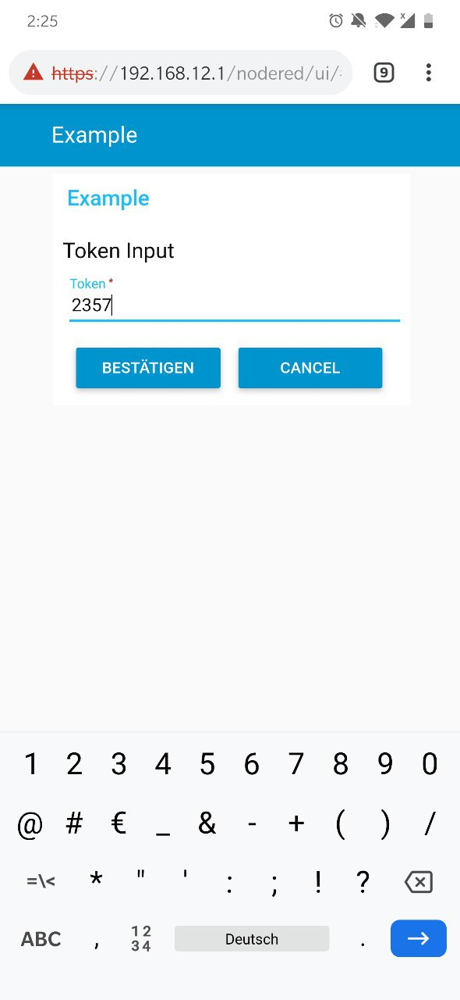
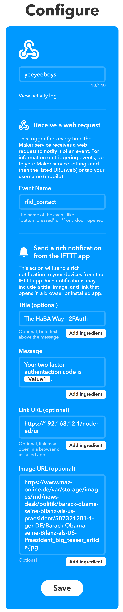

# Please refer to the [global lecture readme file](https://github.com/AdaLollA/HnB-Automation/tree/develop/1%20-%20Lecture/Lecture%20Lorenz) to find the desired resources.

# Smart Lock Progress
This lecture we invested some more time into finalizing the smart lock project.

## Architecture / Flow
When holding an RFID card onto the sensor an mqtt message is sent to node red. NodeRed then communicates with the java-based authentication management server to generate an access key. The key is pushed to the corresponding phone (rfid cards are mapped to users in authentication management server). The notification looks like the following screenshot and contains the authentication code:

When clicking the notification you get automatically forwarded to the node red user interface where you can enter your code and press the confirm button (see image).

 

Node red then again communicates with the authentication management server to assert validity as well as timestamp validation of the provided authentication code. If everything is asserted valid the smart lock opens.

The entire process is finished within a few seconds and the actual latency between pressing confirm and the lock opening can be measured in milliseconds.

## Push Integration
We used IFTTT for push integration with the following configuration that is triggered on webhook (called by NodeRed).

# Personal Opinion
The project is very interesting and a great way to learn about multiple devices as well as infrastructure elements. My personal contribution was architectural and conceptual design as well as the push notification implementation together with Iris. Other participation was performed through assistance in nodered system design.