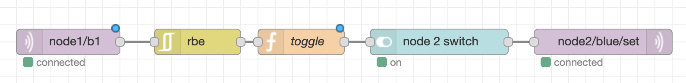
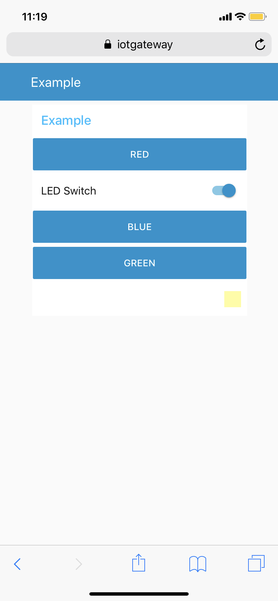
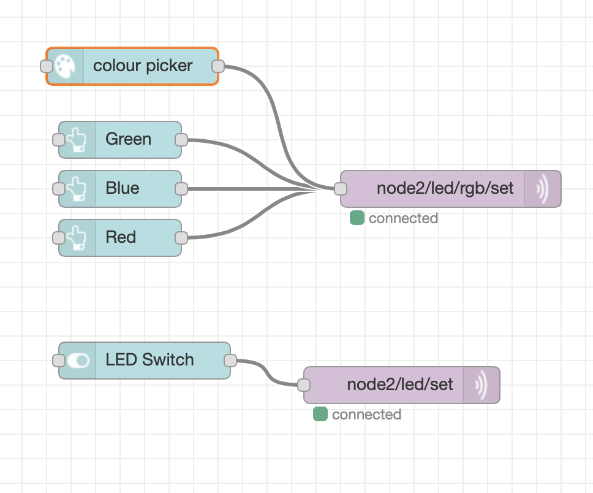
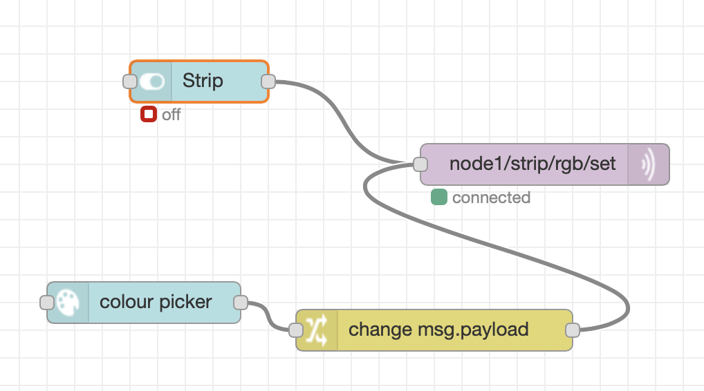
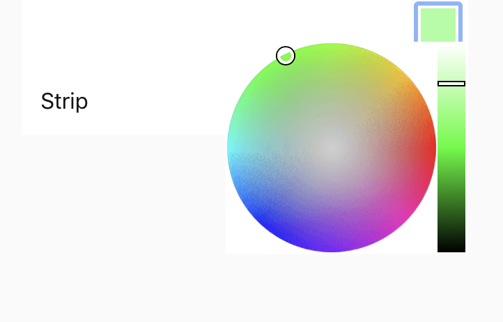
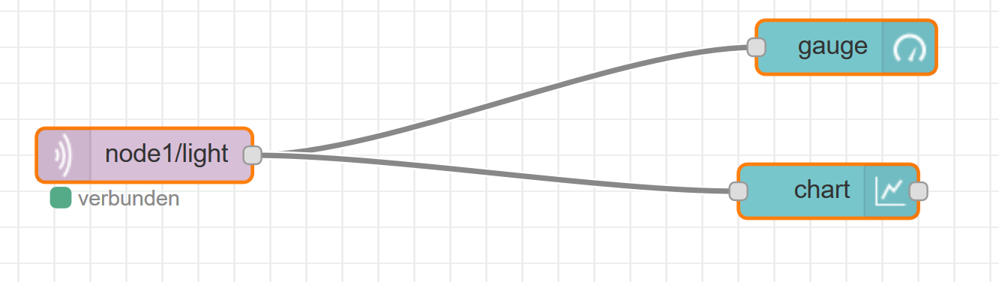
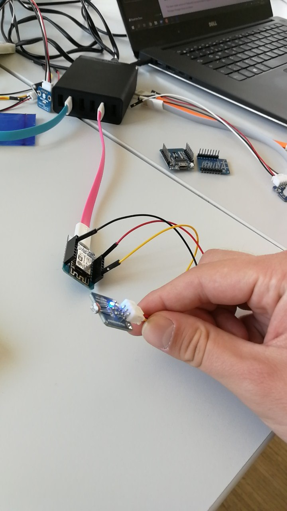
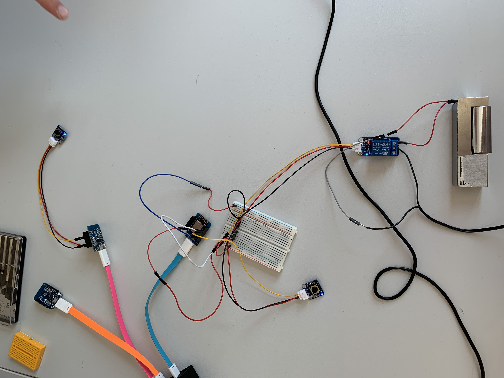
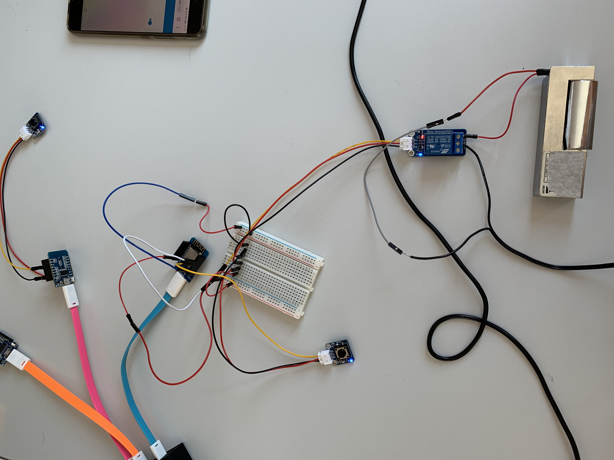

#Lecture #2

## Setting up the Pi, creating nodes and dongles

- 70% of flashing wemos on the raspberry pi fails
- ulno is preflashing us the nodes we need to do the LED blink on
- it would be possible to flash them by ourself via this [link](https://github.com/iotempire/iotempower/blob/master/doc/installation.rst#installation-on-linux)
- if wemos blinks 10x it is in reboot mode

### Presteps to do

We needed to make the pi work to adopt nodes, by executing the following commands:
	
		iot
		rm -rf /home/iot/.platformio/packages/framework-arduinoespressif8266
		cd iot-test/node1/ 
 		compile
 
***

## Blink the Wemos Light
### General
Connecting the Wemos to a power source and the button with the wemos. After that we needed to check [nodeRED](challenge0/ex01_button_nodered.json) for the connection via MQTT (subscribing to the right topics).

Help was provided by ulno via the raspberry pis [help pages](https://iotgateway/doc/nodehelp/button).

### Code in Setup.cpp
		output(blue, ONBOARDLED, "off", "on").set("off");
		input(b1, D3, "depressed", "pressed");

### Hardware Setup
 

### NodeRED Setup

***

## RGB-LED w/ smartphone and NodeRED
### General
Goal was to let an LED blink and change color with a color wheel, when doing changes in nodeRED (or on a smartphone).

For the smartphone access we just had to go to the [UI]() page provided by NodeRED, which was accessible for mobile too. Unfortunatelly we forgot to take a pic (sorry for that).

We were able to find quality help on the [pages](https://iotgateway/doc/node_help/rgb_single) ulno provided in his help directory.
 
### Code in Setup.cpp
 		rgb_single(led, D1, D2, D3, true);
 		
### Hardware Setup

### GUI

### NodeRED Setup

 		
## RGB-LED-Strip w/ NodeRED
### General
Like with the LED we were able to get a LED-strip up and running, by help of the [documentation](https://iotgateway/doc/node_help/rgb_strip). Communication was done through NodeRED again. This time we used the GUI for NodeRED on the laptop as the picture will show later on. NodeRED was exported to be able to redo the [setup](challenge2/led_strip.json).

### Code in Setup.cpp
		rgb_strip(strip, 7, WS2812, D4, GRB);
### NodeRED

### GUI

## Light Sensor
As the third challenge we needed to get up a lightsensor. The used [NodeRED]() to read values from the sensor and visualize it on the NodeRED GUI. 

### NodeRED

### Code in Setup.cpp
			
		analog(light).with_precision(10);
		
### Hardware Setup

	
### GUI

## Smart Lock
So we had to come up with a custom implementation of a smart lock. We were able to do this with a relais, a smart lock and two buttons on the hardware side. We still used [NodeRED](lock/lock-flow.json) to broadcast messages to the relais, when the buttons were pressed. 

### Hardware Setup

### Web Research
As a last challenge we needed to research about ways to secure a smart lock for enabling it for access over the internet. The following findings and links were found on researching the internet:

 - [128 AES Encryption](https://gizmodo.com/are-smart-locks-secure-or-just-dumb-511093690)
 - [Public-Key Infrastructure](https://gizmodo.com/are-smart-locks-secure-or-just-dumb-511093690)
 - [Electric Imp on the Wi-Fi](https://gizmodo.com/are-smart-locks-secure-or-just-dumb-511093690)
 - [Blacklist Key](https://gizmodo.com/are-smart-locks-secure-or-just-dumb-511093690)
 - [VPN](https://www.tomsguide.com/us/secure-smart-home-how-to,news-19380.html)
 - [Smart Bridges](https://unitedlocksmith.net/blog/8-smart-locks-that-you-can-unlock-with-your-smartphone)
