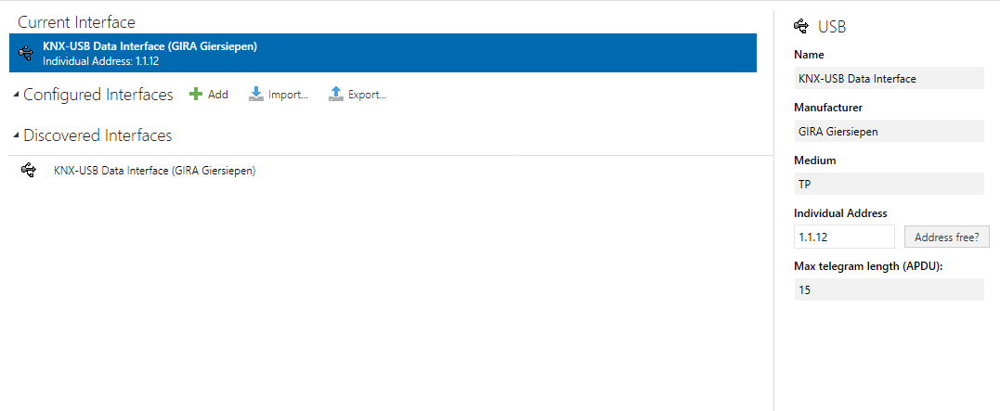
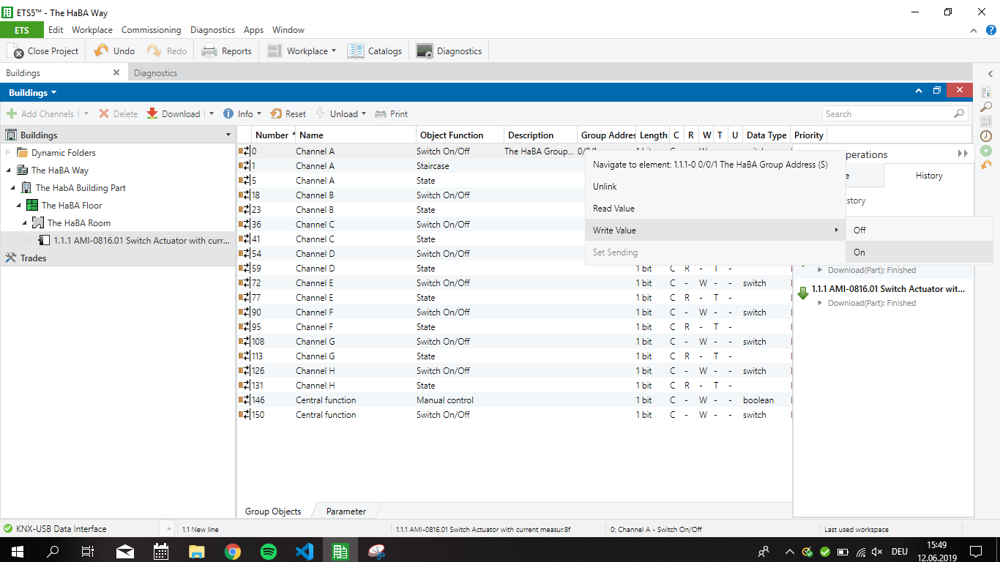
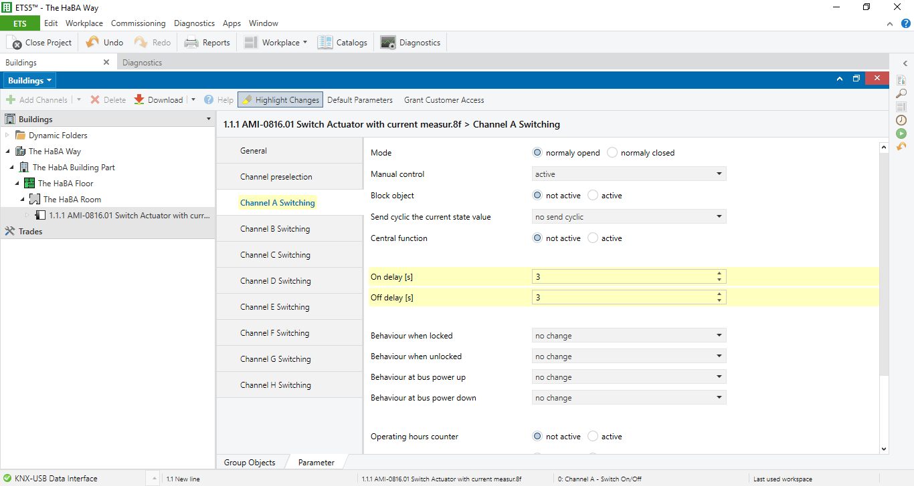
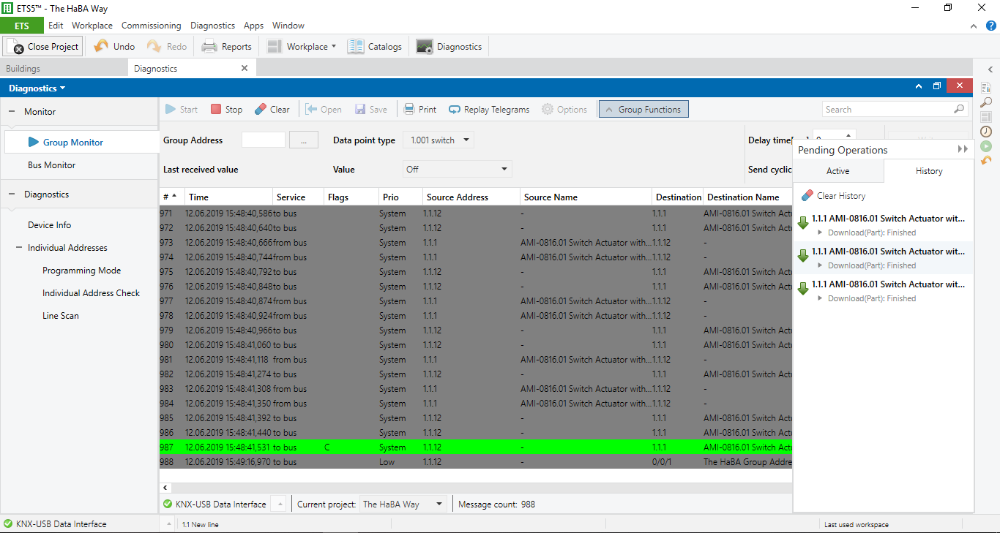

# Lecture 4
## S1810455012, Manuel Leibetseder

(cross-checked with teammates due to meeting during presentations)

### Busses and protocol presentations

- note 2 most important things 
- one question/team that could be asked

For reference, here are all presentations of that day:

- [SPI, I2C, OneWire, Rs-232, RS422, RS485](SPI_I2C_Onewire_RS-232_RS-422_RS-485.pdf)
- [KNX, Ebus, Canbus](presentation_KNX_Ebus_Canbus.pdf)
- [BacNet, LonWorks, ModBus](Bus__Protocol_Research.pdf)

### Research Department Meeting
As I was not present during the presentations, I am referring to my teammates notes on the presentations.

- [Iris](https://github.com/AdaLollA/HnB-Automation/tree/develop/1%20-%20Lecture/Lecture%20Iris/Lecture%204)
- [Lorenz](https://github.com/AdaLollA/HnB-Automation/tree/develop/1%20-%20Lecture/Lecture%20Lorenz/Lecture%204)
- [Micheal](https://github.com/AdaLollA/HnB-Automation/tree/develop/1%20-%20Lecture/Lecture%20Michael/Lecture%204)
- [Alexander](https://github.com/AdaLollA/HnB-Automation/tree/develop/1%20-%20Lecture/Lecture%20Alexander/Lecture%204)

***

#### Ebus

- heating & infrastructure components
- EU standard
- 25 masters/228 slaves

##### Physical Layer
- Master/Slave communication
- 254 primary and 254 secondary commannds

##### Package Structure
- master can initiate communication

##### Data-Link Layer
- master request
- slave response
- master ACK
- master SYN
- master/slave Success message

##### Application Layer
- generic protocols
- expansion packs

***

#### CanBus

- wiring
- automotive industry
- two different standards
- diagnostice interface (purpose)
- support different bus structures
- message orientated
- multi master
- highest priority wins

#### Bus Node
- u-Controller
- CAN-Controller
- CAN-Transeiver

#### Can High
- Transmits data
- normally used for safety- time critical stuff
- two cables different signals

#### Can Low
- confort domain
- simple actors (switches/nobs)

***
***

### Challenges
We got new challenges and needed to complete them. First of all there was a KNX online class to take so we learn the ground rules of ETS5 program to work with KNX.

#### KNX Class

As a first challenge we had to do the tutorials for KNX. The certificate for completing this course can be found [here](https://github.com/AdaLollA/HnB-Automation/blob/develop/1%20-%20Lecture/Lecture%20Manuel/Lecture%204/knxcertification.pdf).

#### KNX Exercise

As there was no time for us to do the exercise in this session, we needed to do it in lecture 5. As I completed the class in this lecture and did the exercise in the next one I sum up in here.

We needed to connect to KNX via an USB interface and use ETS to work with KNX. First adding the KNX device as a device.

We created a new project and then were able to to add:

- A building
- A floor
- A room

and added a: 

- main group
- middle group
- group access. 

In the catalogue we searched for the "AMI-0816.01", which we added to the room.

We selected the switch, turned it on and off and added a delay, like seen in the picture below:

After that, we had a look in the diagnostics and were able to see our changes made to the hardware.

So we were able to control the hardware with the ETS software.

### Personal Opinion // Lesson Learnt

I found it quite interesting to research about the history of older IoT and automation technology, but in my opinion the presentations were a bit too long. 15 minutes/presentation should have been enough to catch up with the hard facts.

The KNX class/tutorial would have been better explained by hands on experience in my opinion. Maybe because Lorenz was the one who was with Ulno when he explained it to one of every group what we need to do. Alexander, Iris, Michael and I were very confused when we went to the energy lab. We didn't even know how to turn the machine on without breaking anything. After Ulno told as what we at least should achive it was a bit more clear to us was we had to do. But the detailes lacked for those exercise at first. Could be done better. I found it cool to be able to control such a device - KNX is in my opinion used very widely, so could be cool to use in my own home.

