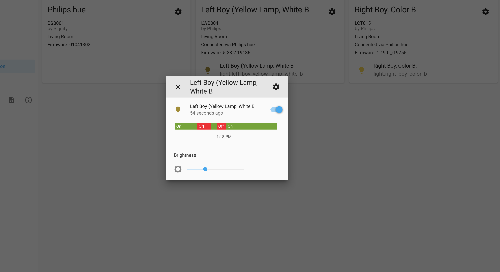

# Lecture 5
## S1810455012, Manuel Leibetseder

### Project 2 Presentations

#### My Jarvis
He has an RFID chip implanted in his right hand

what happens if he is in the pool and the weather turns bad - does he get locked into the pool?

- big home entertainment system
- pool opens/closes automatically
- a lot of wemos, raspis

#### the family group user story

- has a good user story
- no Hue, another bulb including a motion sensor, normal switch (grandma aware)
- they thought of connectivity - 3 WIFI access points
- detailed pool plans
- they haven't found anything for smart garage
- flic.io - dash buttons for ordering (smart buttons)
- Why did you use other bulbs than Hue?

#### Automate friends home
- Roman, 35, rich bitch
- Using Loxone Stuff to automate the home
- Power Redundancy (Battery)
- Calculation of Power Usage
- different approach, work package based presentation
- Why did you use Loxone?


### Project 3 Requirement
- we should use mycroft.ai for voice control


### Home Gateways:
#### Home Assistant & openHAB

I was doing the Home Assistant part, while openHAB exercises were done by Iris. The documentation to openHAB exercise can be found [here](https://github.com/AdaLollA/HnB-Automation/tree/develop/1%20-%20Lecture/Lecture%20Iris/Lecture%205#openhab-experiments).

##### Home Assistant

After installing the python packages required with

```bash
sudo python3 install -m pip install homeassistant
```

We were able to view the home assistant UI by visiting the following link in our browser:
```URL
	http://localhost:8123
```


##### Philips Hue

We need to add the Philips Hue Homebridge and the lightbulbs to the home assistant environment via integration home assitant provides.

```yaml
mqtt:
  broker: 192.168.12.1
  username: iot
  password: iotempire
```

Unfortunately I missed to take pictures of the working environment with home assistent and the Hues. I only got the picture of the logging view of one of the Hues, which shows the group "Philips Hue" and the two Hues seperately in the home assistant UI.


We were able to trigger both hues with home assistant and openHAB. See yourself:


##### Temperature, humidity and light sensor

Next challenge was to include sensors into the home gateways. As already mentioned me and Iris were doing the challenges back to back, she on openHAB and I on Home Assistent while the others were busy with the hardware part of the challenges. We had to add the corresponding yaml configuration to the conf file in ./homeassistant in user folder to actually get the sensors to work. Configuration is as folows:

```yaml
sensor:
  platform: mqtt
  name: "Temperature"
  state_topic: "node2/temperature/temperature"
  qos: 0
  unit_of_measurement: "ºC"

sensor 2:
  platform: mqtt
  name: "Humidity"
  state_topic: "node2/temperature/humidity"
  qos: 0
  unit_of_measurement: "%"
```


We just had to add the sensor values from the hidden entities (which was a bit confusing at first). The values won't show on first try as you need to activate them or customly add them first. All in all I'd use Home Assistant over openHAB as it has a better fitting UI for me and it is more like a programmers approach to integrate the stuff.

##### Kodi

To enable Kodi we installed it on a laptop and enabled remote control via HTTP, UPnP/DLNA. We were able to control Kodi with openHAB which Iris implemented as an openHAB binding. Kodi prove-pictures can be found in the folder, I just don't wanted to include them as this document would get pretty lengthy.


The hardware setup, openHAB and bindings where done by [Alex]() and [Michael](), and as I already mentioned gateways in collab with [Iris](). Z-Wave Controller and Plug we tried to do together as it was a bit of a pita to get it to work properly. I read about the plug in the manual provided by the manufacturer and we finally got it work as the plug needed to be reset and brought into a specific mode. It magically worked afterwards 😁 We also asked another group and combined our knowledge to get it to work.

### Problems on Setup

#### Raspberry Pi wrong config

we had the wrong configs commented in in iotempower.conf. MQTT and WIFI wasn't working any more. Lesson learnt - don't mean like you read. We read on the slides we should comment in everything in that conf. Be more careful

### Support

#### We helped group 2 (Pirklbauer, Schneglberger)

- with openHAB
- with Philips Hue

### Personal Opinion // Lesson Learnt

The Z-Wave stuff was really annoying and frustrating to setup. We actually really didn't know why it wasn't working until we read the manual and reset the Z-Wave plug. The integration then was very easy. Also working with the Hue lights and the sensors with the home gateways was really cool - actually I'll try some automation stuff at home as I am a proud owner of a raspberry pi and I want to find a way to install it besides some other scripts I am running on my little buddy.

As all of the sessions we had before - this one also wasn't an enjoyable session. We had a lot of stress implementing all of the challenges and get it to work. The stress factor in this course was way higher then in any other we had before. Besides IoT in the bachelors program.

I already mentioned KNX was just frustrating at first - but we got it to work pretty fast, thank god. Overall interesting, but I can't say I will take much away again from the session as it was too much to do at all.

