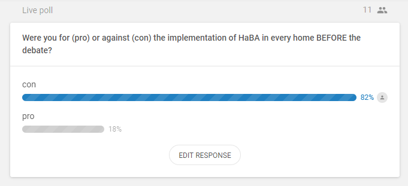

# Project 1

## Debate

### WE ARE THE MODERATOR TEAM

Topic: Everybody should automate their home! True or False?

"intelligence square debates"

- Two teams against the everybody should automate their home
- One team for everybody should automate their home (and Ulno)

- we get bonus points for sharing pro/con arguments
- include audience into discussion
- Platform (https://discord.gg/W8YHNar)

***
***

# Plan

We are the moderators for the debate. Therefore we created a [plan](plan.md) an what we will focus the most. The [video](https://www.youtube.com/watch?time_continue=1&v=xVmShH0-9xY) ulno provided was very helpful and guided us through our planning phase. Our group members met two days before the debate and did an example video we uploaded to [youtube](https://www.youtube.com/watch?v=iGxVoLWiEhA&feature=youtu.be), where you can see the result of how such a debate could look like. Also we documented our plan to come up with a [guidance](Moderator_Notes_Intelligence_Squared.md) during the live debate.

When preparing for the debate, we [summarized](main_topics_of_teams.md) the topics each team (pro/con) posted on our discord server.

***
***

# Debate

During the debate, Lorenz and Iris were busy with moderating the debate, while Manuel, Alexander and Michael were able to take notes. These notes can be viewed in their lecture notes.

We used [sli.do](http://sli.do) to have the audience interact with the two teams and moderator without them beign interrupted.

# Results
After the debate we took screenshots of the results from sli.do. 

## Poll Results
Also after the debate we asked for the audiences opion, for before the debate and after the debate about all people automating their home.

## Influental topics discussed on this debate

And we have a summary of the debate preapred in a short [video](https://www.loom.com/share/5df041b1f0044c17a3e1355317fa7672).